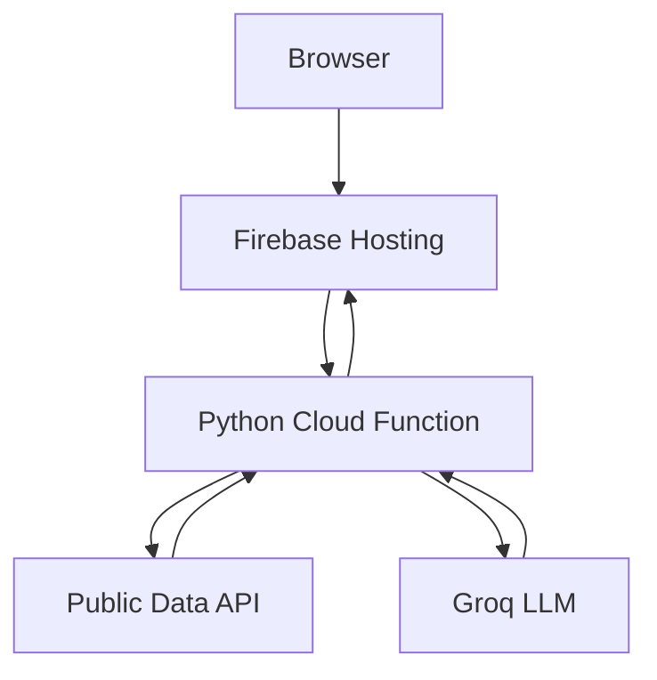
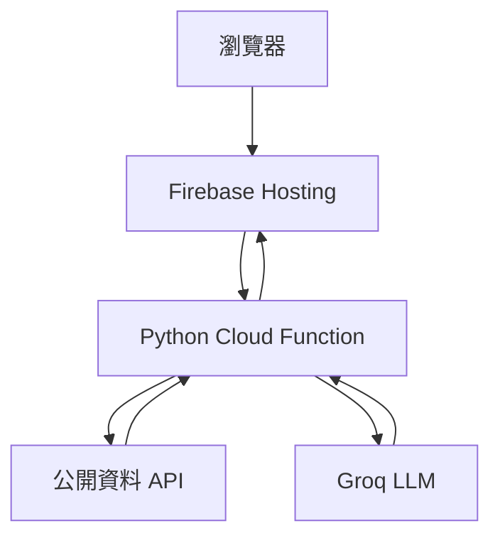

# Architecture

## Request flow

The weather application uses one request to retrieve weather and ask the LLM for advice. The tool assistant uses three observable stages: route, execute, and finish. A signed plan connects the stages without a database.

Firebase Hosting rewrites `/api/**` to the Python HTTPS function named `api`. Flask performs routing inside that function. The backend uses fixed external hosts and explicit timeouts.

## AI Tool Assistant contract

1. `POST /api/agent/route`: the LLM receives four tool schemas and either asks a clarifying question or proposes calls.
2. `POST /api/agent/execute`: Python verifies the signed plan and arguments, then calls the selected public API.
3. `POST /api/agent/finish`: Python verifies all receipts and asks the LLM to answer only from returned data.

Limits: one tool-selection round, at most four calls, six recent text messages, and 15-minute signed tokens. This design improves observability but is not an unbounded autonomous agent.

## Project 3 architecture

The original `api` rewrite above describes Projects 1 and 2. Project 3 uses a uniquely generated `api_lc_<token>` export and separate codebase. ChatGroq binds one compact planning function, and Python dispatches its validated queries to the same four public API families. A dedicated summary invocation receives verified data without planning tools. See [the contract](../langchain-tool-assistant/docs/API.md).

---

# 系統架構

## 請求流程

天氣程式在一次請求中取得天氣並請 LLM 產生建議。工具助理拆成「選擇、執行、整理」三個可觀測階段，以簽署計畫串接，不需要資料庫。

Firebase Hosting 將 `/api/**` rewrite 至名為 `api` 的 Python HTTPS Function，再由 Flask 分派路由。後端只允許固定外部主機，並設定明確逾時。

## AI 工具助理協定

1. `POST /api/agent/route`：模型取得四項工具規格，資訊不足時追問，否則提出工具呼叫。
2. `POST /api/agent/execute`：Python 驗證簽署計畫與參數，再呼叫指定公開 API。
3. `POST /api/agent/finish`：Python 驗證全部收據，要求模型只能依回傳資料回答。

限制為一輪工具選擇、最多四個工具、最近六則文字訊息、簽章 15 分鐘有效。這能提高可觀測性，但不是無限制自主代理人。

## 第三專案架構

上文的 `api` rewrite 適用第一、第二專案。第三專案改用產生的 `api_lc_<代碼>` 與獨立 codebase。ChatGroq 綁定單一精簡計畫工具，Python 將已驗證查詢分派到同樣四類 API。專用摘要呼叫只接收已驗證資料，不附規劃工具。詳見[協定](../langchain-tool-assistant/docs/API.md)。
